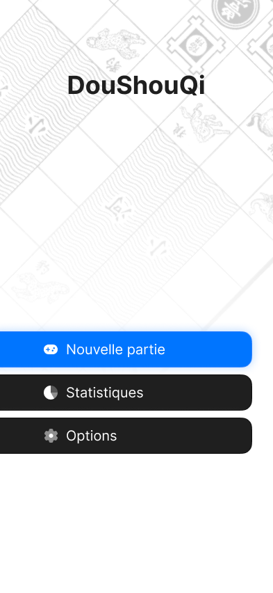
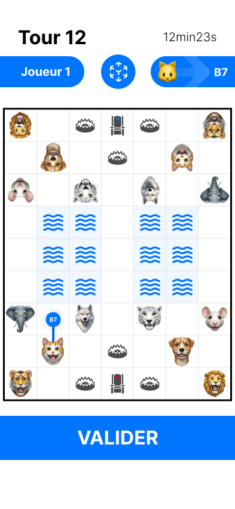

  
    

# DouShouQi-Ui

## Présentation

**Nom de l'application** : DouShouQi

**Récapitulation du Projet**: 👇

Ce projet est une application réalisée en SwiftUI permettant de jouer au jeu DouShouQi avec une interface utilisateur mobile. L'application permet de créer des utilisateurs, de sauvegarder leurs historiques de parties et leurs statistiques. Il est possible de jouer en mode 1v1 ou seul contre un robot.

Les paramètres permettent de modifier le thème de l'application ainsi que de gérer les utilisateurs enregistrés.

Nous avons utilisé SpriteKit pour l'affichage du plateau de jeu ainsi que ARKit pour le rendre en 3D à travers la caméra de l'utilisateur.

L'ensemble du modèle a été fourni par M. Chevaldonné.

## Répartition du Dépôt

La racine de notre dépôt est composé de deux dossier essentielles au projet:

[**Sources**](Sources) : **Code de l'application**

[**Documentations**](Documentations) : **Regroupe l'entièreté  de la documentation**

## Maquettes de l'application

## Développeur en charge de l'application

- Emre KARTAL : emre.kartal@etu.uca.fr
- Lucas DELANIER : lucas.delanier@etu.uca.fr
- Arthur VALIN : arthur.valin@etu.uca.fr